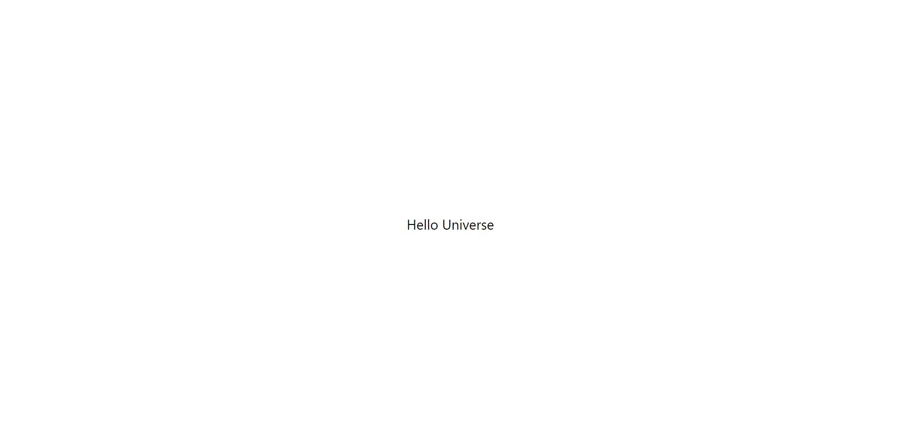
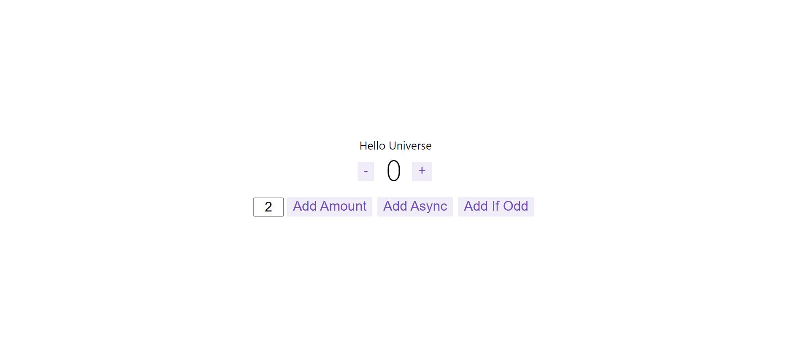

# The [ffc-js-client-side-sdk demo](https://github.com/feature-flags-co/ffc-js-client-side-sdk) for react with redux


## Get started
1. Go to [https://portal.featureflag.co](https://portal.featureflag.co) create your project
2. Create two flags in your environment
    1. **hello** with two options: **Wrold** and **Universe**
    
    2. **counter** with two options: **true** and **false**
    
  

3. Open src/app/ffcConfig.ts and fill the option constant with the right value
```typescript
export const option: IOption = {
    secret: "USE_YOUR_ENVIRONMENT_SECRET", // replace with your won secret
    anonymous: false,
    user: { // you can keep this
        id: 'my-user',
        userName: 'my user',
        email: '',
        customizedProperties: [
            {
                "name": "sex",
                "value": "male"
            }]
    },
    devModePassword: 'thisisademo'
}
```
4. Run
```
npm install
npm run start
```

5. Results:
   1. Hello World
   
   2. Hello Universe
   
   3. Activate counter module
   

